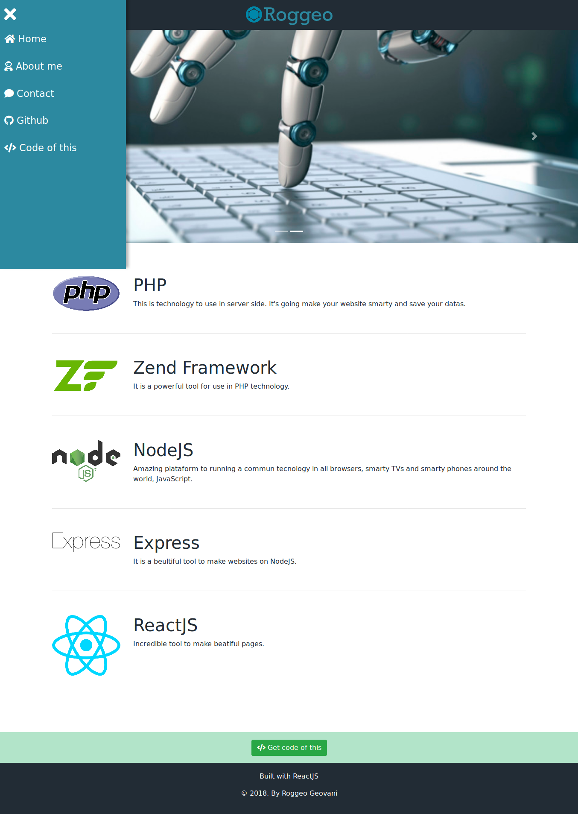

# Webpage

The web personal page.

Example [roggeo.net](http://roggeo.net)

## Install

    git clone git@github.com:roggeo/webpage.git
    cd webpage
    npm install

## Running in DEV mode

Rename ``/public/api.development`` to ``/public/api``

    npm start

Look at [localhost:3000](http://localhost:3000)

## Test

    npm test

## Deploy

1 - Configure ``/public/manifest.json``

2 - Configure ``/.env``

4 - Build the project: ``npm run build``. Loot at ``build`` folder

5 - Move files in build folder to your remote server
